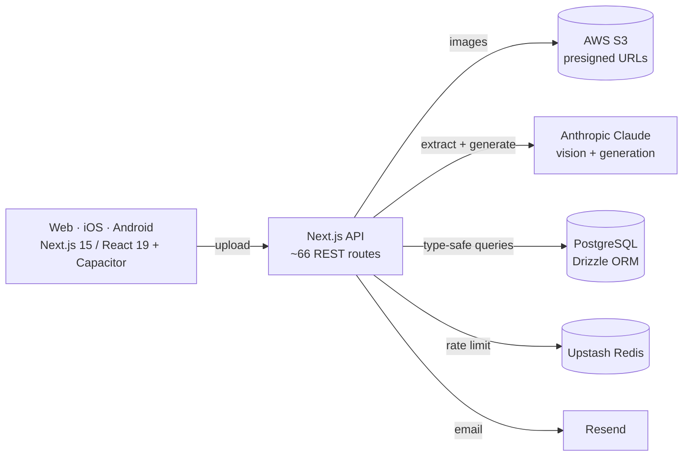

# Study Wizard

**An AI study platform that turns any learning material — a photo of handwritten notes, a textbook PDF, a lecture doc — into interactive, personalized practice tests and study guides.**

Cross-platform (web + native iOS/Android), production-grade, and built solo end-to-end: data model, ~66 API endpoints, AI pipeline, and a polished multi-language UI.

<!-- TODO: hero screenshot or 20-second demo GIF here -->
<!-- 🔗 Live demo: <URL> · 📱 TestFlight/Play beta: <URL> -->

> **Source availability:** This is a private production codebase. This repository is a curated showcase — architecture, engineering highlights, and screenshots. Happy to walk through the code live or grant read access on request.

---

## The problem

Effective studying is bottlenecked by *making good practice materials* — writing questions, spacing reviews, tracking what you got wrong. Study Wizard removes that bottleneck: point it at whatever you're studying and it generates the assessments, schedules the reviews, and adapts to your performance.

## What it does

- **Ingest anything** — camera capture, drag-and-drop upload (images/PDF/DOCX), or Google Drive import; Claude Vision extracts and structures the content, then flags likely OCR/content issues *before* generating a test.
- **9 question types** — multiple choice, fill-in-blank, matching, ordering, select-all, true/false, short answer, cloze deletion, diagram labeling, and spoken recall.
- **Learns with you** — adaptive difficulty plus **FSRS spaced repetition** scheduling reviews at optimal intervals; interleaved practice across topics.
- **AI teaching assistants** — configurable "proctor" personalities give real-time, context-aware feedback and explain wrong answers.
- **Study guides & PDF export** — generate printable guides and tests with answer keys.
- **Classrooms & social** — teacher dashboards, assignments, progress analytics; friend challenges and shared materials.
- **Multi-language** — full UI in English, French, and Spanish.

## Architecture

**Frontend** — Next.js 15 App Router (route groups for public vs. protected), React 19, Tailwind + Radix UI, client-side image compression (canvas resize to 2048px / 85% JPEG) to keep uploads cheap, client-side PDF generation (jsPDF / pdf-lib), Zustand state, `next-intl` i18n.

**Backend** — ~66 Next.js API routes; PostgreSQL via Drizzle ORM (type-safe, migrated); NextAuth v5 (Google OAuth + credentials); AWS S3 with 1-hour presigned URLs; Upstash Redis rate limiting; Resend transactional email; Sentry monitoring.

**AI** — Anthropic Claude for vision-based content extraction and contextual question generation, with a review pass that surfaces extraction issues before test creation.

**Cross-platform** — one Next.js codebase shipped to web and to native iOS/Android via Capacitor.

**Quality** — Vitest + Testing Library, typed env via `@t3-oss/env-nextjs`, end-to-end TypeScript, Zod validation at the boundaries.

## Notable engineering decisions

- **Spaced repetition done right** — `ts-fsrs` (the modern FSRS algorithm, successor to SM-2) rather than naive fixed intervals, so review timing is driven by recall difficulty.
- **Cost-aware media pipeline** — compress on-device before upload, store in S3, hand Claude only what it needs; presigned URLs keep the bucket private.
- **One codebase, three platforms** — Capacitor wraps the Next.js app for iOS/Android without a separate native codebase.
- **Boundary-validated + typed throughout** — Zod at API edges, Drizzle for type-safe DB access, typed environment configuration.

## Tech stack

`Next.js 15` · `React 19` · `TypeScript` · `Tailwind CSS` · `Radix UI` · `PostgreSQL` · `Drizzle ORM` · `NextAuth v5` · `AWS S3` · `Upstash Redis` · `Anthropic Claude` · `Capacitor (iOS/Android)` · `Resend` · `Sentry` · `Vitest` · `Zod`

## My role

Sole designer and developer — product, data model, API, AI pipeline, cross-platform build, and UI.

---

<!-- Screenshots: upload flow · test-taking · results/analytics · classroom dashboard -->
